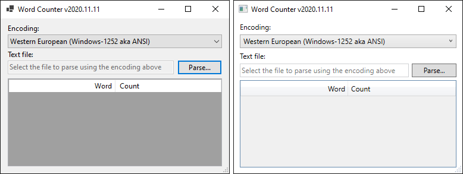
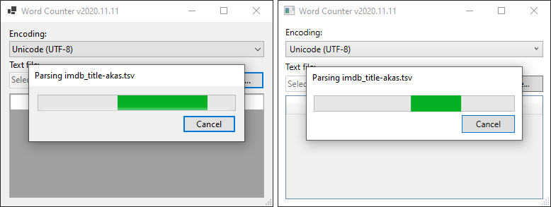
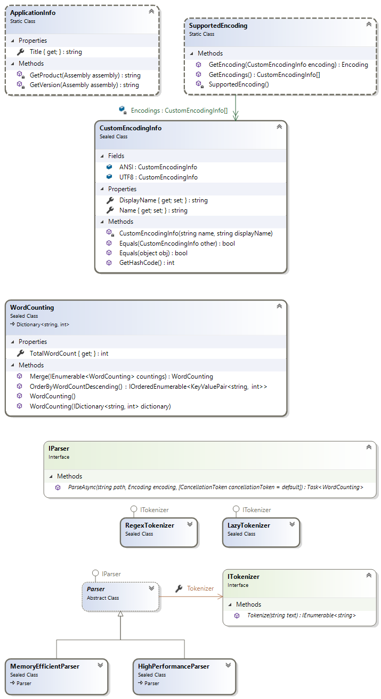

# Word Counter

A coding dojo

## Superstructure

## Substructure

## Backlog

- ~~Progress dialog flicker prevention on smaller text files (parsing time under 0.5 seconds)~~ (implemented in [WordCounter.WinForms](/src/WordCounter.WinForms))
- Fine-grained progress reporting (reading file, decoding text, counting words, percentage)
- ~~GlobalAssemblyInfo.cs~~ (replaced by [Directory.Build.props](Directory.Build.props))
- ~~Microsoft.CodeAnalysis.FxCopAnalyzers conformance~~
- Resource files
- German localization
- Exception handling (File-IO based)
- Representative application icons in multiple sizes
- NuGet package for the [core library](/src/WordCounter)
- Additional statistics (total word count, file size, memory usage, etc.)
- User settings (window size and position, recently parsed files)
- Start-up with the last parsed file pre-loaded (binary serialized stats)
- Installer
- MVVM pattern
- UWP (WinUI / Telerik UI for WPF) solution (Windows 10 only)
- Web application (Angular)

